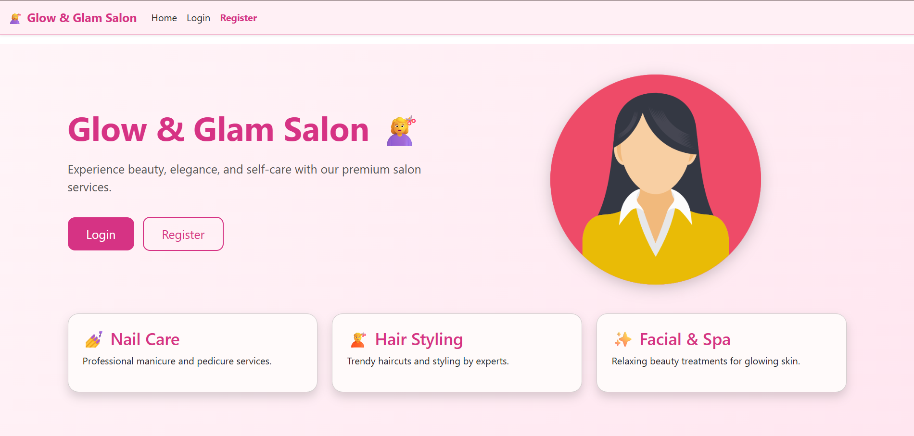
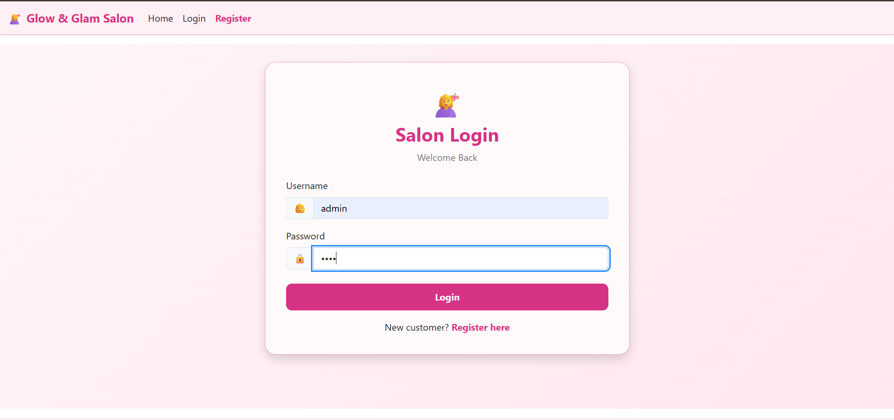
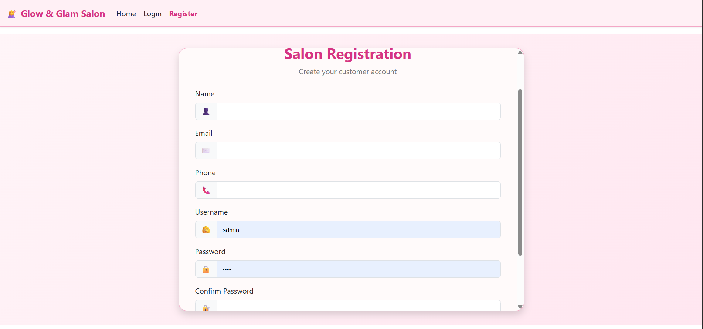
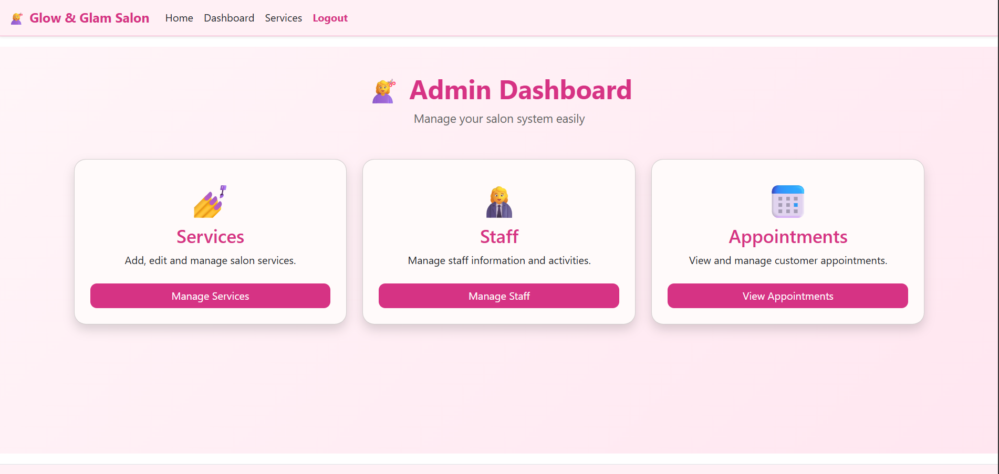
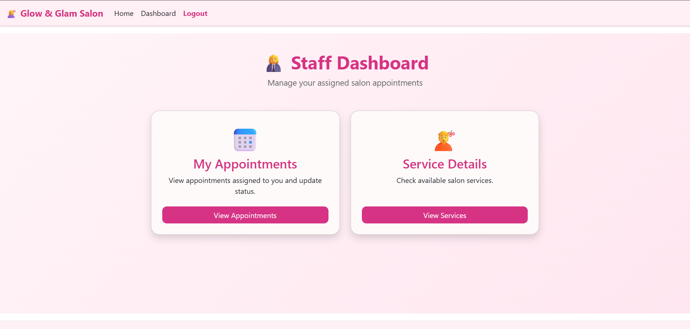
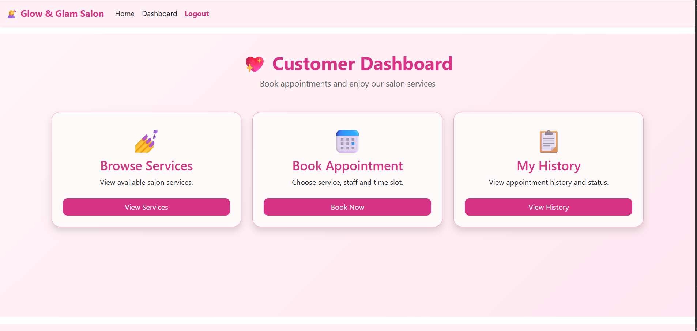
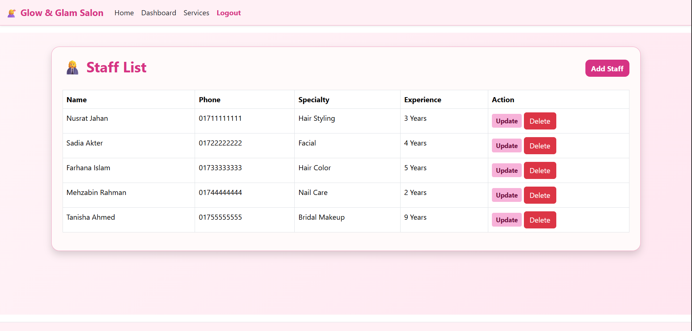
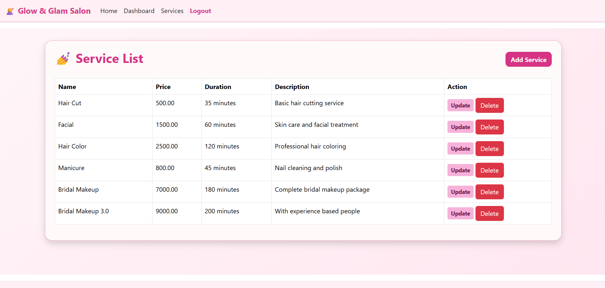
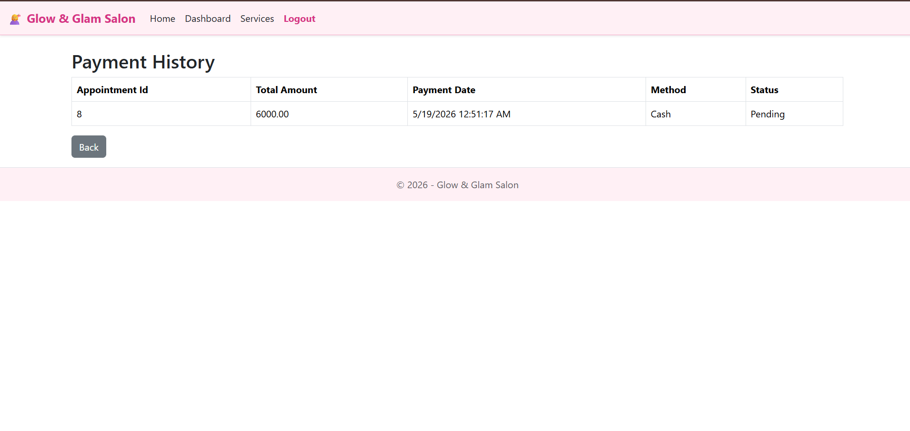

# 💇 Salon Management System (ASP.NET Core MVC)

A role-based Salon Management System built with **ASP.NET Core MVC**, **C#**, **Entity Framework Core**, and **SQL Server**. The application streamlines salon operations by allowing administrators, staff, and customers to manage appointments, services, and payments efficiently.

---

# ✨ Features

- User Authentication & Authorization
- Role-Based Access Control
- Customer Management
- Staff Management
- Service Management
- Appointment Scheduling
- Payment Tracking
- Dashboard Analytics
- Full CRUD Operations

---

# 👥 User Roles

## 👑 Admin

- Manage Customers
- Manage Staff
- Manage Services
- Manage Appointments
- View Payment History
- Dashboard Overview
- Watch Payment History
- Do Payment

## 💼 Staff

- View Dashboard
- View Available Services
- Manage Assigned Appointments
- Update Appointment Status

## 👤 Customer

- Register/Login
- View Dashboard
- Browse Services
- Book Appointments
- View Appointment History

---

# 🛠 Technology Stack

### Backend

- ASP.NET Core MVC
- C#
- Entity Framework Core

### Database

- SQL Server

### Frontend

- HTML5
- CSS3
- Bootstrap
- JavaScript

### Version Control

- Git
- GitHub

---

# 🏗 Architecture

Presentation Layer (MVC)

↓

Business Logic Layer (BAL)

↓

Data Access Layer (DAL)

↓

SQL Server

---

# 📂 Project Structure

```
SalonManagementSystem
│
├── BAL
├── DAL
├── Controllers
├── Models
├── Views
├── wwwroot
└── SQL Server
```

---

# 📸 Screenshots

## Landing Page



---

## Login



---

## Register



---

## Admin Dashboard



---

## Staff Dashboard



---

## Customer Dashboard



---

## Staff Management



---

## Service Management



---


## Payment History



---


# 🚀 Installation

1. Clone the repository

```
git clone <repository-url>
```

2. Open the project using Visual Studio.

3. Configure the SQL Server connection string.

4. Apply Entity Framework migrations.

5. Run the application.

---

# 📚 Learning Outcomes

- Applied Object-Oriented Programming (OOP)
- Implemented ASP.NET Core MVC
- Built Layered Architecture (Presentation, BAL, DAL)
- Developed CRUD Operations
- Managed SQL Server Database
- Practiced Git & GitHub Version Control

---

# 🔮 Future Improvements

- Email Notifications
- SMS Appointment Reminder
- Online Payment Gateway
- Analytics & Reports
- Mobile Responsive Enhancements

---

# 👩‍💻 Author

**Eshika Rani Pall**

GitHub: https://github.com/EEEshika